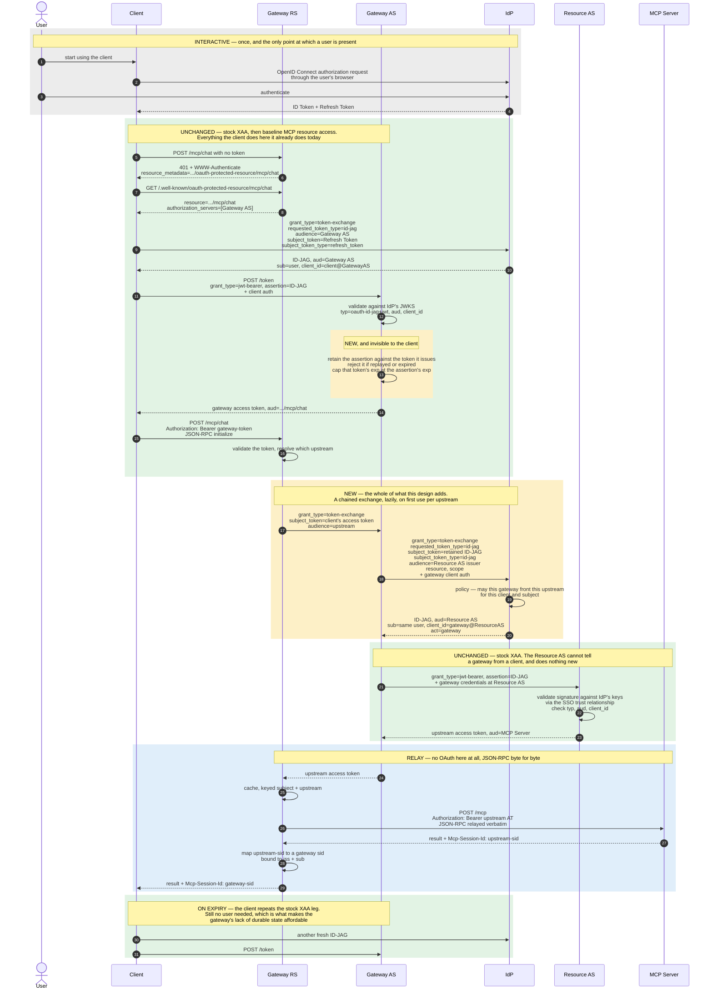

# Identity Assertion Authorization Grant for Gateways

This is the working area for an individual Internet-Draft extending
[Cross App Access](https://datatracker.ietf.org/doc/draft-ietf-oauth-identity-assertion-authz-grant/)
to work when a **gateway** sits between the client and the resource server.

* [**Draft source**](draft-parecki-oauth-identity-assertion-gateways.md)
* [Editor's Copy](https://aaronpk.github.io/draft-parecki-oauth-identity-assertion-gateways/#go.draft-parecki-oauth-identity-assertion-gateways.html)
* [Datatracker Page](https://datatracker.ietf.org/doc/draft-parecki-oauth-identity-assertion-gateways)
* [Individual Draft](https://datatracker.ietf.org/doc/html/draft-parecki-oauth-identity-assertion-gateways)

The short version: a gateway needs its own access token for each resource behind it, on behalf of
the same user. This draft defines one new token exchange at the Identity Provider that lets it get
one, and nothing else. Clients and resource servers are unaffected, and no new identifiers are
registered.

## The problem

The Identity Assertion Authorization Grant (an "ID-JAG") lets a client reach a resource in another
application without asking the user to log in again. The client presents an identity assertion to
the enterprise IdP, gets back an ID-JAG for the resource's authorization server, and redeems it
there for an access token. Two hops, and the client talks to the resource server directly.

Enterprises don't always want that direct connection. They want a gateway in the middle — to apply
policy, to log what agents are doing, to filter or aggregate what a client can see. The motivating
case here is a gateway fronting several MCP servers, though nothing about the problem is specific
to MCP.

Inserting a gateway breaks the flow, and it isn't obvious why until you look at where the tokens
are addressed:

```
  base Cross App Access          with a gateway in the middle

  Client                          Client
    |                               |
    | access token for the          | access token for the
    | resource server               | GATEWAY  <-- the resource server
    v                               v              will not accept this
  Resource Server                 Gateway
                                    |
                                    | ??? it needs an access token for
                                    v     the resource server, for the
                                  Resource Server    same user
```

A gateway is an OAuth resource server to the client and an OAuth client to the resource behind it.
So it terminates the client's token — that token's audience is the gateway, and the resource server
is right to reject it — and it has to independently obtain a token of its own.

The natural move is for the gateway to go back to the IdP and exchange what it has for an ID-JAG
of its own. But what does it present? The only thing it holds is an access token it issued itself,
and **the IdP cannot validate a token it did not issue.** That's the crux. Making the IdP able to
validate it means either the IdP trusting keys the gateway publishes, or the IdP calling the
gateway to introspect. Both invert the direction of trust the rest of the flow depends on, and both
would leave a gateway able to obtain assertions for any user at any time.

The observation this draft rests on is that the gateway holds one more thing: **the ID-JAG the
client just redeemed with it.** The IdP issued that, so the IdP can verify it, and its `aud` claim
proves which party it was issued to. That is enough.

## Design goals

Cross App Access got adopted quickly, and that was not an accident. The effort was distributed
according to motivation: **the parties with the least reason to care have the least to do.**

* The **resource AS** has the least inherent motivation. The status quo works fine for them, and
  they arguably lose something, since XAA means users interact with agents rather than with their
  web interface. So their work is one new grant type — existing token format, no changes to their
  resource servers, existing SSO connections.
* The **client** has real motivation. Today users blame the client when they're made to log into
  every resource separately. So the client does more: two new steps in its SSO flow, plus some
  configuration.
* The **IdP** has the most motivation. Its customers are the enterprises whose resources are being
  protected, not the client's end users. So the IdP does the most work, including the management
  interfaces customers need to configure policy.

Extending XAA to gateways must preserve that principle, and gateways don't change who is
motivated. A gateway vendor sells to the same customer as the IdP and is highly motivated. Clients
and resource ASes gain nothing from a gateway's presence — from their side a gateway is supposed to
be transparent. **Gateways are the ones inserting themselves into the flow, so gateways and IdPs
should carry the cost.**

That gives three hard requirements, which the draft holds itself to:

1. **No changes to the client** over base XAA. A client that implements Cross App Access today
   works with a gateway with no modifications and no awareness that a gateway is involved. This is
   not a nicety — clients have already shipped.
2. **No changes to the resource server or its AS** over base XAA. The ~25 implementers who just
   built ID-JAG validation cannot be asked to revisit it. The resource AS receives an ordinary
   ID-JAG from a registered client and validates it exactly as before.
3. **The IdP and the gateway may do new work.** That's where the motivation is, and where the new
   flow belongs.

Two security constraints fall out of ordinary OAuth practice and are worth stating because they
rule out most of the shortcuts:

* **An entity only processes tokens issued to it or by it.** Every token in this flow is either
  addressed to the entity handling it or was minted by that entity. Nothing is replayed outside
  its intended audience.
* **An AS and an RS must remain separable or collapsible, with no new requirement either way.**
  Whether a gateway runs its own authorization server or uses a separate one is a deployment
  decision between those two components, and it must not change the protocol anyone else speaks.

## What the extension adds

```
                            +----------------+
                            |    Identity    |
                            |    Provider    |
                            +----------------+
                              ^     ^      :
                    (1) ID-JAG|     |(2)   : SSO trust
                       request|     |NEW   : relationship
                              |     |      :
  +--------+                  |     |      :     +----------------+
  | Client |------------------+     |      :.....|   Resource     |
  +--------+                        |            | Authorization  |
    |    |                          |            |     Server     |
    |    |  (3) ID-JAG grant  +-----+------+     +----------------+
    |    +------------------->|  Gateway   |          ^
    |                         |   Authz    |----------+
    |                         |   Server   |  (4) ID-JAG grant
    |                         +------------+
    |                            ^
    | (5) resource request       | (6) NEW, OPTIONAL
    v                            |
  +------------------+           |
  | Gateway Resource |-----------+
  |      Server      |
  +------------------+
    |
    | (7) resource request
    v
  +------------------+
  | Resource Server  |
  +------------------+
```

Interactions 1, 3, 4, 5 and 7 are base Cross App Access and base resource access, unchanged. The
draft defines only:

**(2) The Chained Identity Assertion Request** — required. The gateway's authorization server
presents the ID-JAG it was given as the `subject_token`, with `subject_token_type` set to the
existing `urn:ietf:params:oauth:token-type:id-jag`, and asks for an ID-JAG whose audience is the
resource's authorization server. The IdP verifies the assertion was issued *to that gateway*,
applies the customer's policy, and issues a new assertion with the same subject, an `act` claim
naming the gateway, and the gateway's own `client_id` at the resource AS. The gateway then redeems
it exactly as any client would.

**(6) The Upstream Token Request** — optional, and only needed when a gateway's authorization
server and resource server are separate deployments. An ordinary RFC 8693 token exchange, which
collapses to an internal function call when the two are one process. This is what keeps the AS/RS
split a private matter, as the second security constraint requires.

That's the whole extension. Notably, it needs **no new IANA registrations**: the `id-jag` token
type URI is already registered by the base spec, and this draft uses it in one additional position.

### The whole flow, colour-coded

Every message in the gateway case, using an MCP gateway as the concrete example. Green is
behaviour that already exists — base Cross App Access, and ordinary resource access with a bearer
token. Amber is everything this draft adds. Blue is the gateway proxying the protocol, with no
OAuth in it at all.



The point of the colours is that the amber total is the entire cost of supporting gateways, and
**every amber message has the IdP or the gateway at both ends of it.** Nothing amber touches the
client or the resource AS, which is what the three requirements above demand. The one amber step
inside the green block is internal to the gateway's authorization server and invisible to the
client.

## What it deliberately does not do

Neither exchange returns a refresh token, and that's a design decision rather than an oversight.

A gateway holding a refresh token could obtain assertions for a user with no client driving it —
which makes it a client in its own right, not a gateway. So a gateway here holds nothing durable:
a short-lived assertion for the life of one access token, and access tokens it can always obtain
again. Discard every byte of a gateway's state and the next request rebuilds it, which bounds what
a compromised gateway yields to the sessions active at the time.

This costs nothing in capability, because a client can already act while the user is away. The base
spec permits an IdP-issued refresh token as the subject token precisely because an assertion is
usually requested long after the user's ID token expired. The client's absence would be a problem;
the *user's* absence is not.

## Contributing

Issues and pull requests are welcome. Substantive discussion of the underlying grant belongs on the
[OAuth working group mailing list](https://mailarchive.ietf.org/arch/browse/oauth/).

